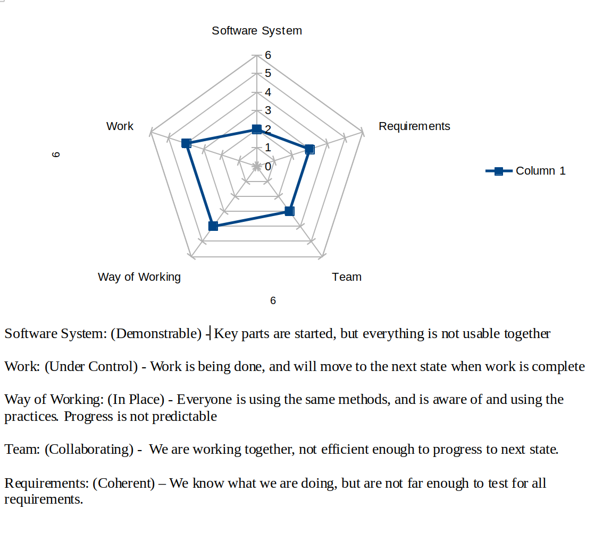

# CS_3321_Project
## Description
Implementation for a Game game using microservices to communicate between a client and a server. Two Players from different computers will be able to play a version of Game via a cloud server.

## Table of Contents
- [Installation](#installation)
- [Usage](#usage)
- [Team](#team)
- [Progress](#progress)
- [Technologies Used](#technologies-used)
- [MVP Front End](#front-end)
- [MVP Back End](#back-end)
- [License](#license)

## Installation
## Usage

## Team
Thomas Neyman - Scrum Master
Caleb Eardley - Product Owner
Garrett Stouffer 
Pawan Kandel

## Progress

## Technologies Used
Programming Language - Java (front and back)
InteliJ IDE  
Gradle  
Testing - J Unit Jupiter  
Microsevices - Javalin  
UI - Javafx

## MVP
### Front End
The front end will consist of a UI that displays a 8x8 modified monopoly board with property spaces, tax spaces, chance spaces, as well as a Go space, a Jail space, a go to jail space, and free parking. Through the front end, the user, if it is there turn can roll a dice, and if th player lands on a for sale property, buy said property. The opposing player can choose to buy it if the player declines. It will also give players options to get out of jail, such as roll doubles or pay bail.
### Back End
The back end will keep track of players turns, money, owned property, and bills. It will take the dice roll from the front end, and move the players that amount. When a player is on an oponents property rent will automatically be taken and given to the owner. When Players cross go they will get $200. The backend will also track when players go to jail, and if they pay bail, or roll doubles. When a player is out of money that player loses. It will exist on a cloud server and connect to the front end using javalin.

## License
MIT License

Copyright (c) [2021] [CS3321 Group 2]

Permission is hereby granted, free of charge, to any person obtaining a copy
of this software and associated documentation files (the "Software"), to deal
in the Software without restriction, including without limitation the rights
to use, copy, modify, merge, publish, distribute, sublicense, and/or sell
copies of the Software, and to permit persons to whom the Software is
furnished to do so, subject to the following conditions:

The above copyright notice and this permission notice shall be included in all
copies or substantial portions of the Software.

THE SOFTWARE IS PROVIDED "AS IS", WITHOUT WARRANTY OF ANY KIND, EXPRESS OR
IMPLIED, INCLUDING BUT NOT LIMITED TO THE WARRANTIES OF MERCHANTABILITY,
FITNESS FOR A PARTICULAR PURPOSE AND NONINFRINGEMENT. IN NO EVENT SHALL THE
AUTHORS OR COPYRIGHT HOLDERS BE LIABLE FOR ANY CLAIM, DAMAGES OR OTHER
LIABILITY, WHETHER IN AN ACTION OF CONTRACT, TORT OR OTHERWISE, ARISING FROM,
OUT OF OR IN CONNECTION WITH THE SOFTWARE OR THE USE OR OTHER DEALINGS IN THE
SOFTWARE.
